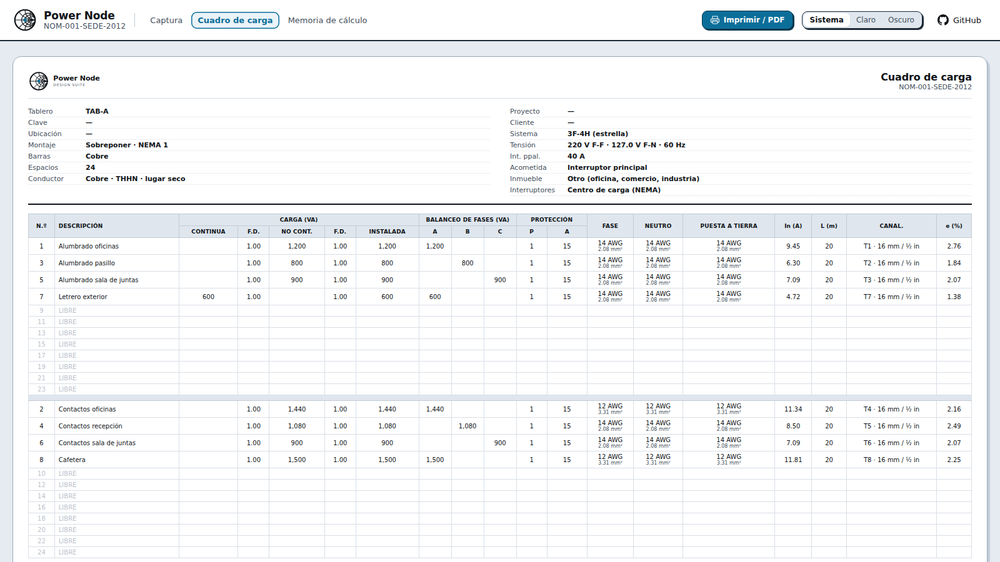
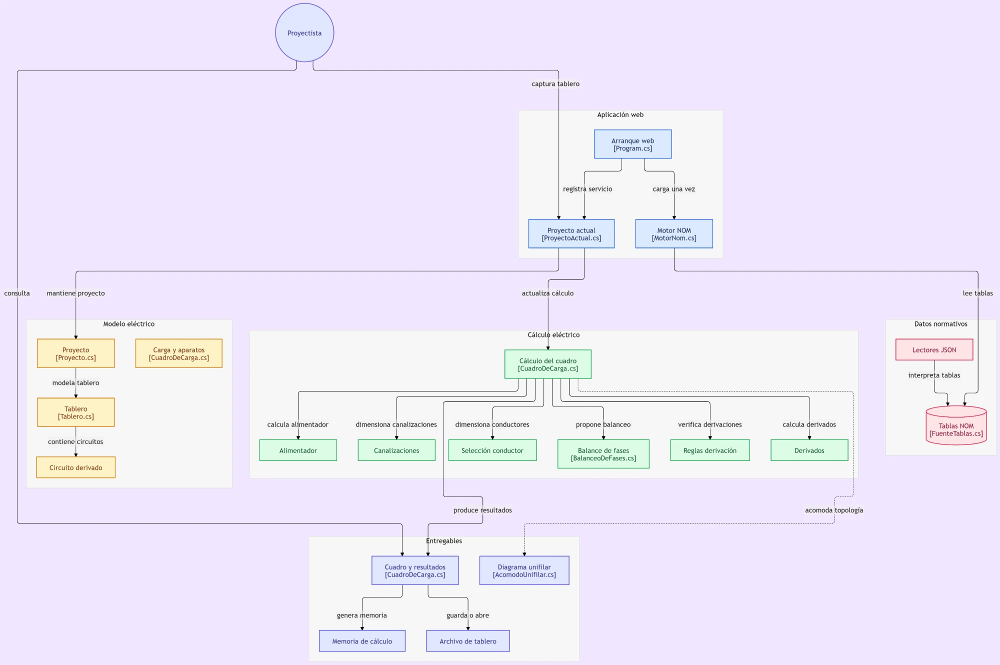

[](https://dflores296.github.io/Power-Node-Web/)

[](https://github.com/dflores296/Power-Node-Web/actions/workflows/ci.yml)
[](https://github.com/dflores296/Power-Node-Web/actions/workflows/deploy.yml)


# Power Node Web

El **cuadro de carga de un tablero** según la **NOM-001-SEDE-2012**, entero en el navegador. Sin
instalar nada y sin servidor: se abre la página, se capturan los circuitos y sale el cuadro de carga
con su memoria de cálculo, lista para imprimir.

**[Abrir la herramienta →](https://dflores296.github.io/Power-Node-Web/)**

> **No sustituye el criterio de quien firma el proyecto.** Cada resultado lleva la cita del artículo
> o la tabla de la que sale, pero aprobar una instalación es una decisión de ingeniería y, en su
> caso, de una Unidad de Verificación — no un número que devuelva una página.

## Para qué sirve

Antes de armar un tablero hay que saber qué protección y qué conductor lleva cada circuito, cómo
quedan repartidas las fases y con qué se alimenta. Eso es el **cuadro de carga**, y es parte de toda
memoria técnica de una instalación eléctrica en México.

Power Node lo resuelve para **un tablero** de hasta 42 espacios:

| Qué | Cómo | Referencia |
|---|---|---|
| **Protección** de cada circuito | 125 % de la continua + 100 % de la no continua, al tamaño normalizado | 210-20(a), 240-6(a) |
| **Conductor** | Ampacidad por aislamiento, temperatura, agrupamiento y terminales | 310-15, 110-14(c) |
| **Canalización** | Portadores por tubo, ajuste por agrupamiento y llenado | Capítulo 10 |
| **Caída de tensión** | Con la impedancia eficaz, fase por fase en el alimentador | Tabla 9 |
| **Motores** | En HP: corriente de tabla, conductor al 125 %, protección de la Tabla 430-52; en el alimentador, 125 % del mayor por fase | Art. 430 |
| **Alimentador y principal** | Factor de demanda por tipo de carga, fase que gobierna, mínimos de acometida | Art. 220, 215, 230-79 |
| **Balanceo** | El interior del gabinete dibujado; los circuitos se mueven arrastrándolos | — |

La lista completa, con la prueba que verifica cada requisito, está en
[`docs/conocimiento/requisitos.md`](docs/conocimiento/requisitos.md).

## Cómo se usa

1. **Captura** — los datos del tablero (sistema, tensión, acometida, inmueble) y un renglón por
   circuito: carga en VA, W o A, factor de potencia y tipo; un motor, en HP.
2. **Cuadro de carga** — la tabla de 24 columnas con el resumen de carga. Cada protección y cada
   conductor tiene su desglose en tooltip.
3. **Memoria de cálculo** — nueve secciones con las fórmulas y sus números sustituidos.

El tablero se guarda en un archivo `.powernode.json` y se abre de vuelta; se pueden tener varios
abiertos, uno por pestaña. Todo se queda en el navegador: no hay cuenta ni servidor.

## Datos

Las 18 tablas que usa el cálculo se extraen de
[NOM-001-SEDE-2012](https://github.com/dflores296/NOM-001-SEDE-2012), donde están contrastadas
celda por celda contra el PDF del DOF. **La integración continua clona ese repositorio en cada
compilación** y falla si la copia de aquí se despegó (`tools/extraer_tablas.py --check`).

El motor de cálculo se copia de `PowerNode-DesignSuite`, la versión de escritorio, sin su base de
datos ni su catálogo de equipos — ver
[`docs/decisiones/motor-copiado-no-enlazado.md`](docs/decisiones/motor-copiado-no-enlazado.md).

## Desarrollo

```bash
dotnet run --project src/PowerNode.Web --urls http://127.0.0.1:5199
dotnet test tests/PowerNode.Normativa.Tests
dotnet test tests/PowerNode.Web.Tests
```

Blazor WebAssembly sobre .NET 8. Publicación en GitHub Pages con
[`.github/workflows/deploy.yml`](.github/workflows/deploy.yml) en cada push a `main`.

## Estructura

| Ruta | Contenido |
|---|---|
| `src/PowerNode.Web/` | La aplicación Blazor: páginas, componentes y `wwwroot/` |
| `src/PowerNode.Web.Modelo/` | El cuadro de carga: circuitos, alimentador, memoria y archivo |
| `src/PowerNode.DesignSuite.Calculo/` | Motor de cálculo, copiado del escritorio |
| `src/PowerNode.DesignSuite.Domain/` | Entidades del motor, copiadas del escritorio |
| `src/PowerNode.DesignSuite.Normativa/` | Lectura de las tablas de la NOM desde JSON |
| `tests/` | Pruebas de las tablas y del cuadro de carga |
| `tools/` | Utilidades del repositorio, no de la aplicación |
| `docs/` | Estado, decisiones y referencia técnica |

## Arquitectura



Diagrama generado con [GitDiagram](https://github.com/ahmedkhaleel2004/gitdiagram), de
Ahmed Khaleel.

## Documentación

**[`docs/README.md`](docs/README.md)** es el índice, y dice qué es estado vigente y qué es
referencia. Los que más se consultan:

- [`docs/estado/TABLERO.md`](docs/estado/TABLERO.md) — cómo vamos y qué falta
- [`docs/estado/HALLAZGOS.md`](docs/estado/HALLAZGOS.md) — defectos con ID y commit de cierre
- [`docs/conocimiento/requisitos.md`](docs/conocimiento/requisitos.md) — cada requisito con su
  referencia NOM y su prueba
- [`docs/conocimiento/seleccion-conductor-y-proteccion.md`](docs/conocimiento/seleccion-conductor-y-proteccion.md)
  — matriz de trazabilidad contra la norma
- [`docs/decisiones/alcance-v1-un-tablero.md`](docs/decisiones/alcance-v1-un-tablero.md) — qué
  entra y qué se descartó

## Alcance

**Un tablero, como el Excel original.** Sin cascada de tableros, sin coordinación de protecciones y
sin catálogo de equipos. Lo que se evaluó y se dejó fuera, con su razón, está en
[`docs/decisiones/alcance-v1-un-tablero.md`](docs/decisiones/alcance-v1-un-tablero.md).

## Licencia

**Código visible, no código abierto.** Copyright (c) 2026 dflores296, todos los derechos
reservados. El repositorio es público para poder consultarlo y para alojar el sitio en GitHub Pages,
pero **no** se concede licencia de uso, copia, modificación ni redistribución. Ver
[LICENSE](LICENSE).

Las tablas de la norma (`tablas-nom.json`) conservan la licencia CC BY-SA 4.0 del repositorio del
que se extraen; el texto de la NOM no es objeto de derecho de autor (art. 14 de la LFDA).

## Marcas

Square D es marca registrada de Schneider Electric. NEMA es marca registrada de National Electrical
Manufacturers Association. Este proyecto no está afiliado ni avalado por ellos, y **no** incluye
datos de su catálogo — ver
[`docs/decisiones/sin-catalogo-square-d.md`](docs/decisiones/sin-catalogo-square-d.md). Se les
menciona únicamente como referencia técnica.
